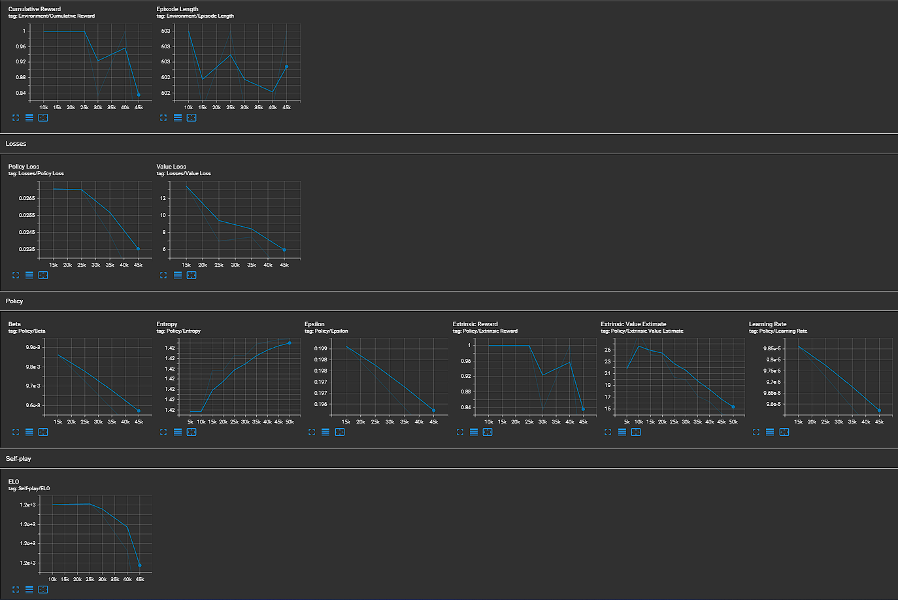
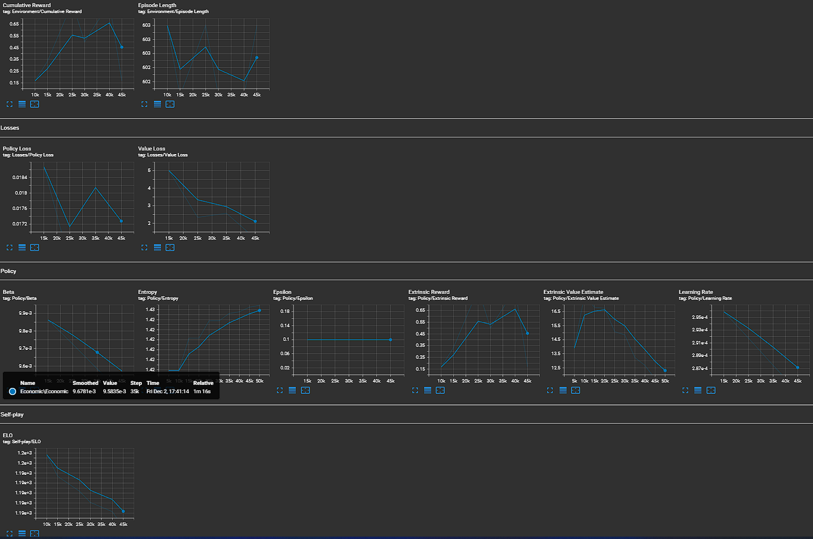
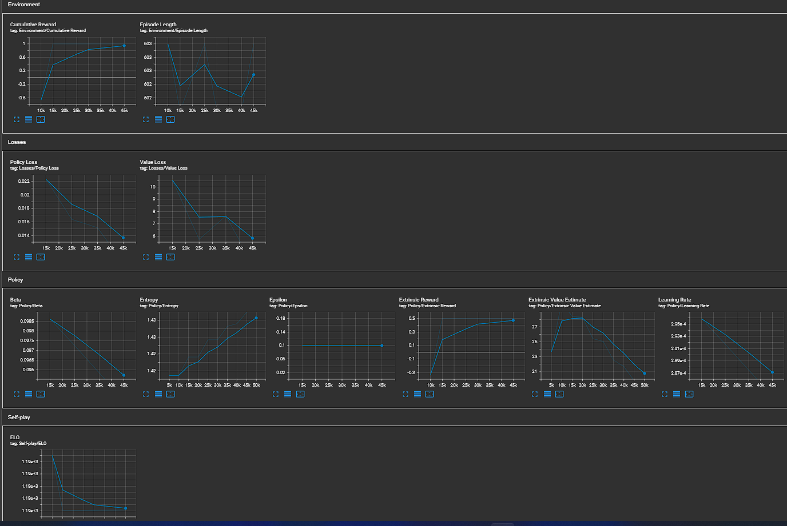

# АНАЛИЗ ДАННЫХ И ИСКУССТВЕННЫЙ ИНТЕЛЛЕКТ [in GameDev]
Отчет по лабораторной работе #5 выполнил:
- Ельмуратов Темирлан Кеулимжаевич
- РИ-210913

Отметка о выполнении заданий (заполняется студентом):

| Задание | Выполнение | Баллы |
| ------ | ------ | ------ |
| Задание 1 | * | 60 |
| Задание 2 | * | 20 |

знак "*" - задание выполнено; знак "#" - задание не выполнено;

Работу проверили:
- к.т.н., доцент Денисов Д.В.
- к.э.н., доцент Панов М.А.
- ст. преп., Фадеев В.О.

[](https://nodesource.com/products/nsolid)

[](https://travis-ci.org/joemccann/dillinger)

Структура отчета

- Данные о работе: название работы, фио, группа, выполненные задания.
- Цель работы.
- Задание 1.
- Код реализации выполнения задания. Визуализация результатов выполнения (если применимо).
- Задание 2.
- Код реализации выполнения задания. Визуализация результатов выполнения (если применимо).
- Выводы.
- ✨Magic ✨

## Цель работы
Интеграция экономической системы в проект Unity и обучение ML-Agent.

## Задание 1
### Измените параметры файла. yaml-агента и определить какие параметры и как влияют на обучение модели.

Скачал и открыл проект, подключил к нему библиотеки ML-Agent.

Добавил в папку проекта Economic.yaml с таким содержанием:

```yaml
behaviors:
  Economic:
    trainer_type: ppo
    hyperparameters:
      batch_size: 1024
      buffer_size: 10240
      learning_rate: 3.0e-4
      learning_rate_schedule: linear
      beta: 1.0e-2
      epsilon: 0.2
      lambd: 0.95
      num_epoch: 3      
    network_settings:
      normalize: false
      hidden_units: 128
      num_layers: 2
    reward_signals:
      extrinsic:
        gamma: 0.99
        strength: 1.0
    checkpoint_interval: 500000
    max_steps: 750000
    time_horizon: 64
    summary_freq: 5000
    self_play:
      save_steps: 20000
      team_change: 100000
      swap_steps: 10000
      play_against_latest_model_ratio: 0.5
      window: 10
```

Запустил обучение:


Установил TensorBoard и открыл графики:


Уменьшил параметр learning_rate с 3.0e-4 до 3.0e-5. Получил такие графики:


График Cumulative Reward стал абсолютно плоским, а должен плавно расти. График  Параметр ELO начал увеличиваться - это хорошо. 

Попробал уменьшить параметр learning_rate, но не так сильно. Установил значение 1.0e-4



Также в диапазоне значений от 1.0e-4 до 3.0e-4 особых изменений не было. 


Вернул значение learning_rate к изначальному 3.0e-4 и уменьшил значение lambd с 0.95 на 0.9. Cumulative Reward дежится около 1, график Policy Loss убывает, параметр ELO начал расти.


Увеличил значение batch_size с 1024 до 2048. Значение Cumulative Reward начал от 0 до 1, Policy Loss растёт, ELO - падает.


Уменьши значение epsilon с 0.2 до 0.1. Cumulative Reward растёт более плавно, Policy Loss и ELO падают.



Установил strength: 0.5 (было 1). График Cumulative Reward опять "лёг" около значаения 1, но ELO начала расти, Policy Loss падает.


Изменил значение beta на 1.0e-1. Cumulative Reward растёт, Policy Loss и ELO падают.



## Задание 2
### Опишите результаты, выведенные в TensorBoard. 

`Cumulative Reward`- Средняя совокупная награда за эпизоды над всеми Агентами. Должен увеличиваться во время успешной тренировки.

`Episode Length`- Средняя продолжительность каждого эпизода в среде для всех агентов.

`Policy Loss` - Средняя величина функции потерь. Коррелирует с тем, насколько меняется политика (процесс принятия решений о действиях). Величина должна уменьшиться во время успешной тренировки.

`Value Loss` - Средняя потеря обновления функции значений. Коррелирует с тем, насколько хорошо модель способна предсказать значение каждого состояния. Должно увеличиваться, пока агент учится, а затем уменьшаться, как только вознаграждение стабилизируется.

`Entropy` - Насколько случайны решения модели. Должно медленно снижаться во время успешной тренировки. Если она уменьшается слишком быстро следует увеличить гиперпараметр beta.

`Extrinsic Reward` - Соответствует среднему кумулятивному значению награды, полученной от окружающей среды за эпизод.

`Learning Rate` - Насколько велик шаг алгоритма обучения берется по мере поиска оптимальной политики. Должно уменьшаться с течением времени.

`ELO`- измеряет относительный уровень мастерства между двумя игроками. При правильном тренировке график должен неуклонно увеличиваться.

## Выводы

В ходе этой лабораторной работы я интегрировал в проект Unity экономическую систему и обученил ML-Agent по этой системе. Также я познакомился с приложением TensorBoard, которое строит графики для оценки результатов обучения.
